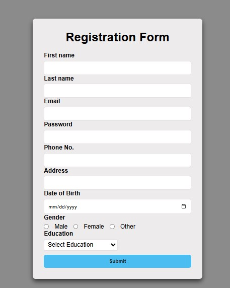

# registration-form-ui

# Simple Registration Form

A clean, responsive, and modern user registration form built using HTML and CSS. This project serves as a sleek UI starter template for user authentication and sign-up flows.

##  Features

* **Clean Card Layout:** Centered UI with a soft drop-shadow for a modern aesthetic.
* **Comprehensive Fields:** Includes text inputs, password masked fields, date pickers, radio buttons, and dropdown select menus.
* **Fully Responsive:** Adapts seamlessly to various desktop and mobile screen sizes.
* **User-Friendly UX:** Structured hierarchy with bold, legible labels and intuitive spacing.

## Preview

Below is the user interface design for this registration form:

##  Tech Stack

* **HTML5:** Structured semantic markup for form elements.
* **CSS3:** Flexbox/Grid layout, custom border-radii, drop shadows, and responsive media queries.

## Form Fields Included

* **First Name & Last Name:** Standard text inputs.
* **Email:** Validated email input field.
* **Password:** Masked text input for security.
* **Phone No. & Address:** Standard contact details.
* **Date of Birth:** Native HTML5 date picker calendar wrapper.
* **Gender:** Custom radio button selection (Male, Female, Other).
* **Education:** Dropdown selection menu.
* **Submit Button:** Vibrant, full-width action call-to-action button.

